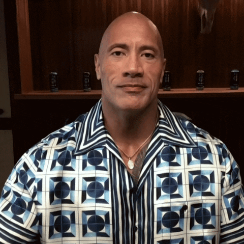

<!-- Hi There section -->

<h3S align="center">Hi there, I'm <a href="https://fawad4bros.github.io/"  target="_blank">Fawad Naeem</a> 👋</h3>

  

<!-- What do I do most of my time? -->

<h3 align="center">What do I do most of my time?</h3>

  

<!-- counts -->

 

<!-- stats -->

<h3>Github Stats: </h3>
 
    <table>
        <tr>
            <td>
                
            </td>
            <td>
                
            </td>
        </tr>
    </table>

<!-- connect -->
<h3>Connect</h3>
  

  

